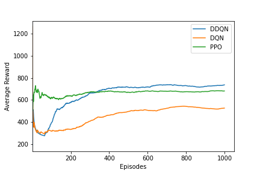
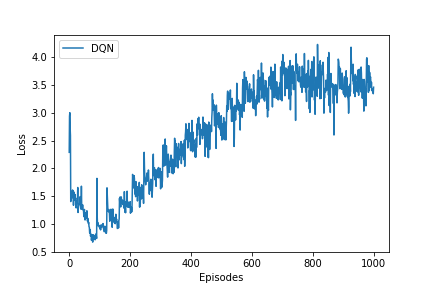
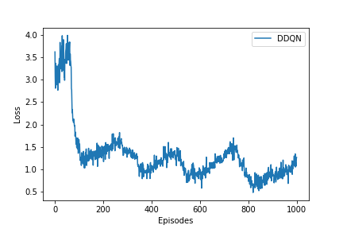
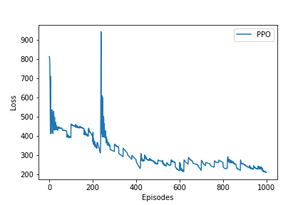
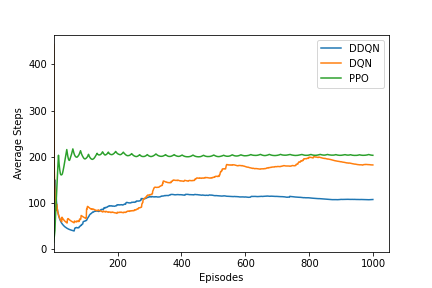
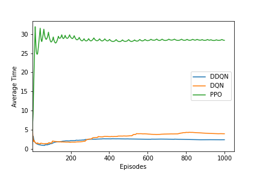

# 🍄 Deep Reinforcement Learning Agents for Super Mario Bros

[](https://python.org)
[](https://pytorch.org)
[](LICENSE)

A comparative study of three Deep Reinforcement Learning agents — **DQN**, **Double DQN (DDQN)**, and **PPO** — trained to play *Super Mario Bros* (World 1-1) using the [gym-super-mario-bros](https://github.com/Kautenja/gym-super-mario-bros) environment.

---

## 🎮 Demo

A demo of a model under training


---

## 📋 Project Overview

This project implements and compares three DRL agents on the NES Super Mario Bros environment:

| Agent | Algorithm | Architecture | Key Idea |
|-------|-----------|-------------|----------|
| DQN | Q-Learning + Neural Net | CNN | Learns Q-values with experience replay |
| DDQN | Double Q-Learning | CNN | Separates action selection & evaluation to reduce overestimation |
| PPO | Policy Gradient | CNN + Actor-Critic | On-policy method with clipped surrogate objective |

All agents use **frame stacking (4 frames)**, **grayscale preprocessing**, and an **84×84 pixel** observation space.

---

## 📊 Results

### Average Reward per Episode


### Training Loss
| DQN | DDQN | PPO |
|-----|------|-----|
|  |  |  |

### Steps Per Episode & Training Time
 


## 🧠 Agent Architectures

### CNN Backbone (DQN & DDQN)
```
Input: (4, 84, 84) stacked grayscale frames
  → Conv2d(4, 32, kernel=8, stride=4) + ReLU
  → Conv2d(32, 64, kernel=4, stride=2) + ReLU
  → Conv2d(64, 64, kernel=3, stride=1) + ReLU
  → Linear(3136, 512) + ReLU
  → Linear(512, n_actions)
```

### Key Hyperparameters

| Parameter | Value |
|-----------|-------|
| Learning Rate | 0.00025 |
| Discount Factor γ | 0.90 |
| Batch Size | 32 |
| Replay Buffer Size | 30,000 |
| Exploration Decay | 0.99 |
| Target Net Update | Every 5,000 steps |
| Optimizer | Adam |
| Loss Function | Huber (SmoothL1) |

---

## 🗂️ Repository Structure

```
super-mario-drl/
├── agents/
│   ├── DQNSolver.py        # DQN and DDQN model + agent class
│   ├── dqn_ddqn.py         # Training and testing scripts for DQN/DDQN
│   └── PPO.ipynb           # PPO agent (Jupyter Notebook)
├── wrappers/
│   ├── BufferWrapper.py    # Frame stacking wrapper
│   ├── ImageToPyTorch.py   # Frame normalization & channel ordering
│   ├── MaxAndSkipEnv.py    # Frame skipping wrapper
│   └── MarioRescale.py     # Resize frames to 84x84
├── figures/                # Training plots
├── demo/                   # Gameplay GIF
├── requirements.txt
└── README.md
```

---

## ⚙️ Setup & Installation

### Requirements
- Python 3.7+
- PyTorch
- gym-super-mario-bros
- OpenCV
- NumPy, Matplotlib

### Install

```bash
git clone https://github.com/bazzal99/super-mario-drl.git
cd Super-Mario-DRL
pip install -r requirements.txt
```

### `requirements.txt`
```
gym==0.26.0
gym-super-mario-bros==7.4.0
nes-py==8.1.8
torch>=1.10.0
torchvision>=0.11.0
numpy>=1.21.0
opencv-python>=4.5.0
matplotlib>=3.4.0
tqdm>=4.62.0
Pillow>=8.3.0
stable-baselines3>=1.5.0
```

---

## 🚀 Training

**Train DQN:**
```python
# In dqn_ddqn.py, set:
train(pretrained=False, double_dqn=False, num_episodes=1000)
```

**Train DDQN:**
```python
train(pretrained=False, double_dqn=True, num_episodes=1000)
```

**Train PPO:**
Open and run `agents/PPO.ipynb` in Jupyter.

**Continue training from checkpoint:**
```python
train(pretrained=True, double_dqn=True, num_episodes=1000)
```

---

## 🧪 Testing

```python
# Test DDQN agent (generates super_mario_test.gif)
test(double_dqn=True, num_episodes=4, exploration_max=0.05)
```

---


## 📐 Environment Preprocessing Pipeline

```
Raw RGB Frame (240×256×3)
  → MaxAndSkipEnv     : skip 4 frames, take max of last 2 (reduces flickering)
  → MarioRescale84x84 : resize + grayscale → (84, 84, 1)
  → ImageToPyTorch    : HWC → CHW, normalize pixels to [0, 1]
  → BufferWrapper     : stack 4 consecutive frames → (4, 84, 84)
  → JoypadSpace       : restrict to SIMPLE_MOVEMENT (7 actions)
```

---

## 🔍 Key Design Choices

- **Frame stacking** captures temporal motion (Mario's velocity, trajectory)
- **SIMPLE_MOVEMENT** action space (7 actions) keeps training tractable
- **Huber loss** (SmoothL1) is more robust to outliers than MSE for Q-learning
- **DDQN** fixes the Q-value overestimation bias of vanilla DQN by decoupling action selection (local net) from action evaluation (target net)
- **PPO**'s clipped objective prevents destructively large policy updates

---

## 📚 References

- Mnih et al. (2015) — [Human-level control through deep reinforcement learning](https://www.nature.com/articles/nature14236)
- Van Hasselt et al. (2016) — [Deep Reinforcement Learning with Double Q-learning](https://arxiv.org/abs/1509.06461)
- Schulman et al. (2017) — [Proximal Policy Optimization Algorithms](https://arxiv.org/abs/1707.06347)
- [gym-super-mario-bros](https://github.com/Kautenja/gym-super-mario-bros) by Christian Kauten

---

## 👤 Author

**Mohammad Bazzal**  
ML Engineer | PhD in Telecommunications  
[LinkedIn](https://www.linkedin.com/in/mohammad-bazzal-3b768b20b/) · [GitHub](https://github.com/bazzal99)

---

## 📄 License

MIT License — see [LICENSE](LICENSE) for details.
